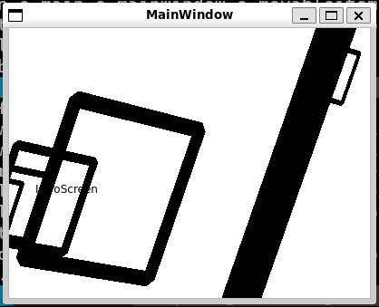
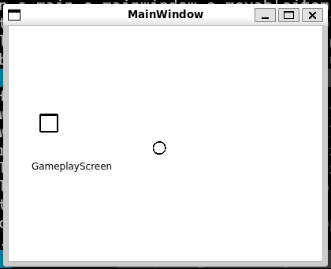
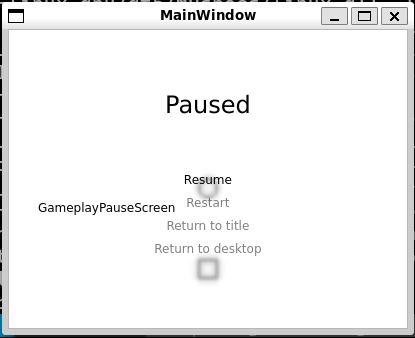

# "pacman"

大學時的程式設計（二）課程期末作業。

## 操作方式

### 開場畫面（IntroScreen）

* <kbd>Esc</kbd>：跳過開場動畫
* <kbd>↑</kbd>/<kbd>↓</kbd>/<kbd>←</kbd>/<kbd>→</kbd>/<kbd>Shift</kbd>/<kbd>/</kbd>：上/下/左/右/出螢幕/入螢幕移動世界
* <kbd>W</kbd>/<kbd>S</kbd>/<kbd>A</kbd>/<kbd>D</kbd>/<kbd>Q</kbd>/<kbd>E</kbd>：沿 X/Y/Z 軸方向旋轉世界
* <kbd>8</kbd>/<kbd>2</kbd>/<kbd>4</kbd>/<kbd>6</kbd>/<kbd>+</kbd>/<kbd>-</kbd>：上/下/左/右/出螢幕/入螢幕移動所有方框
* <kbd>H</kbd>/<kbd>J</kbd>/<kbd>K</kbd>/<kbd>L</kbd>：左/下/上/右移動視窗
* <kbd>N</kbd>/<kbd>.</kbd>/<kbd>,</kbd>/<kbd>M</kbd>：橫/縱縮放視窗

### 遊戲畫面（GameplayScreen）

規則：玩家（方框）需移動避開幽靈（圓圈），碰到幽靈則遊戲結束。

* <kbd>Esc</kbd>：暫停，或跳過遊戲結束的淡出
* <kbd>↑</kbd>/<kbd>↓</kbd>/<kbd>←</kbd>/<kbd>→</kbd>/<kbd>+</kbd>/<kbd>-</kbd>：上/下/左/右/出螢幕/入螢幕移動
* <kbd>Shift</kbd>：加速移動
* <kbd>W</kbd>/<kbd>S</kbd>/<kbd>A</kbd>/<kbd>D</kbd>/<kbd>Q</kbd>/<kbd>E</kbd>：沿 X/Y/Z 軸方向旋轉世界
* 技能（有冷卻時間）：
  * <kbd>B</kbd>：暫時排斥幽靈
  * 按住 <kbd>X</kbd>：時停移動（有秒數限制）

### 遊戲暫停畫面（GameplayPauseScreen）

* <kbd>Esc</kbd>：繼續遊戲（Resume）
* <kbd>R</kbd>：重新開始（Restart）
* <kbd>Q</kbd>：回到標題畫面（Return to title）
* <kbd>Alt</kbd>-<kbd>F4</kbd>：回到桌面（Return to desktop）
* <kbd>↑</kbd>/<kbd>↓</kbd>：上/下選擇項目
* <kbd>Enter</kbd>：選中項目
